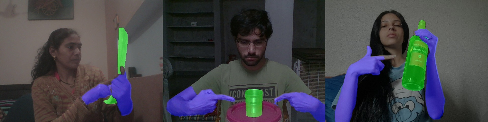
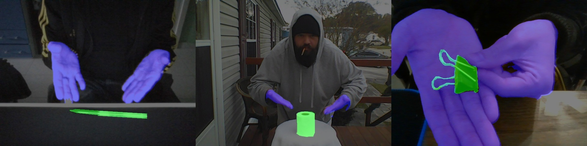

# Gesture-aware Interactive Machine Teaching with In-situ Object Annotations (UIST 22)


<p align="center">
  
</p>

### [Project Page](https://zhongyi-zhou.github.io/GestureIMT/) | [Paper](https://arxiv.org/abs/2208.01211)
<br>

> [**Gesture-aware Interactive Machine Teaching with In-situ Object Annotations**]() <br>
> [Zhongyi Zhou](https://zhongyizhou.net/), [Koji Yatani](https://iis-lab.org/member/koji-yatani/) <br>
> The University of Tokyo <br>
> UIST 2022 <br>
> **Abstract**: Interactive Machine Teaching (IMT) systems allow non-experts to easily create Machine Learning (ML) models. However, existing vision-based IMT systems either ignore annotations on the objects of interest or require users to annotate in a post-hoc manner. Without the annotations on objects, the model may misinterpret the objects using unrelated features. Post-hoc annotations cause additional workload, which diminishes the usability of the overall model building process. In this paper, we develop LookHere, which integrates in-situ object annotations into vision-based IMT. LookHere exploits users' deictic gestures to segment the objects of interest in real time. This segmentation information can be additionally used for training. To achieve the reliable performance of this object segmentation, we utilize our custom dataset called HuTics, including 2040 front-facing images of deictic gestures toward various objects by 170 people. The quantitative results of our user study showed that participants were 16.3 times faster in creating a model with our system compared to a standard IMT system with a post-hoc annotation process while demonstrating comparable accuracies. Additionally, models created by our system showed a significant accuracy improvement ($\Delta mIoU=0.466$) in segmenting the objects of interest compared to those without annotations.


## Getting Started
This code has been tested on PyTorch 1.12 with CUDA 11.6 and PyTorch 1.10 with CUDA 11.3.

To install PyTorch 1.12 with CUDA 11.6,
```
chmod +x ./install/init_cuda_11_6.sh
./install/init_cuda_11_6.sh
```

To install PyTorch 1.12 with CUDA 11.3,
```
chmod +x ./install/init_cuda_11_3.sh
./install/init_cuda_11_3.sh
```

### If you are using other versions
(not necessary if the code above succeeds.)
This project may also work in other version of PyTorch.
You can exam the required packages under ```./initialization.sh``` and install them by yourself. You also need to download two checkpoint files from [Google Drive](https://drive.google.com/drive/folders/148N8SedToltmiKUDxOiSGpNW1S_gcW_f?usp=sharing):
- put ```resnet18_adam.pth.tar``` under ```./demo_app/src/ckpt/``` and ```./object_highlights/ckpt/```
- put ```unet-b0-bgr-100epoch.pt``` under ```./demo_app/src/ckpt/```

## Website Demo


### Initialization 
```
conda activate lookhere
cd demo_app
./gen_keys.sh
```
Run the server
```
python app.py
```

### Teaching


Then you can access the teaching interface via 
- https://0.0.0.0:8080/teach?user=000_test&interface=3

You can also access this website through LAN:
- https://ip.ip.ip.ip:8080/teach?user=000_test&interface=3

Check [demo_app/README.md](demo_app/README.md) for more details on how to use the app.
### Training

All your teaching data will be stored at ```./tmp/000_test/```. You can start training using
```
./src/trainer/train.sh ./tmp/000_test/ours/ 1
```

This project does not include the function for automatic training in the system. Please implement this function yourself by refering to the codes used above.

### Model Assessment

Once the training process finishes, you can assess your model via this link:
- https://0.0.0.0:8080/assess?user=000_test&interface=3 or
- https://ip.ip.ip.ip:8080/assess?user=000_test&interface=3 


## HuTics: Human Deictic Gestures Dataset
HuTics covers covers four kinds of deictic gestures to objects. Note that we only annotate the segmentation masks of the objects. The hand segmentation masks are generated from [this work](https://github.com/GoGoDuck912/Self-Correction-Human-Parsing).

**This dataset is under the license of [[CC-BY-NonCommercial]](https://creativecommons.org/licenses/by-nc/4.0/).**

Download: 
[[google drive]](https://drive.google.com/file/d/1bCWQW123BGZUdqOJws6F9PHFeQbkMmkZ/view?usp=sharing)

<table>
  <tr>
    <td>Exhibiting</td>
    <td>Pointing</td>
  </tr>
  <tr>
    <td></td>
    <td></td>
  </tr>
  <tr>
    <td>Presenting</td>
    <td>Touching</td>
  </tr>
  <tr>
    <td></td>
    <td></td>
  </tr>
 </table>

## Gesture-aware Object-Agnostic Segmentation

You need to first download the HuTics dataset above.


Start training the network. Please check the following path to your dataset location.
```
cd object_highlights
conda activate lookhere
./trainer/train.sh PATH_TO_HUTICS
```

After the training process finishes, you need to convert the rgb-based ckpt into the bgr-based one.
```
python utils/ckpt_rgb2bgr.py --input ${YOUR_INPUT_RGB_MODEL.pt} --output ${YOUR_OUTPUT_BGR_MODEL.pt}
```

The model is now ready, and you can use the trained model for the inference.

```
python demo_video.py --objckpt ${YOUR_OUTPUT_BGR_MODEL.pt} 
```

The output video will be at ```vids/tissue_out.mp4```

## Related Work
- [Marcelle](https://github.com/marcellejs/marcelle)
- [Teachable Machine](https://github.com/googlecreativelab/teachable-machine-v1)
- [Self Correction for Human Parsing](https://github.com/GoGoDuck912/Self-Correction-Human-Parsing)

## Citations
```bibtex
@misc{zhou2022gesture,
  doi = {10.48550/ARXIV.2208.01211},
  url = {https://arxiv.org/abs/2208.01211},
  author = {Zhou, Zhongyi and Yatani, Koji},
  title = {Gesture-aware Interactive Machine Teaching with In-situ Object Annotations},
  publisher = {arXiv},
  year = {2022}
}

@inproceedings{zhou2021enhancing,
author = {Zhou, Zhongyi and Yatani, Koji},
title = {Enhancing Model Assessment in Vision-Based Interactive Machine Teaching through Real-Time Saliency Map Visualization},
year = {2021},
isbn = {9781450386555},
publisher = {Association for Computing Machinery},
address = {New York, NY, USA},
url = {https://doi.org/10.1145/3474349.3480194},
doi = {10.1145/3474349.3480194},
pages = {112–114},
numpages = {3},
keywords = {Visualization, Saliency Map, Interactive Machine Teaching},
location = {Virtual Event, USA},
series = {UIST '21}
}
```
