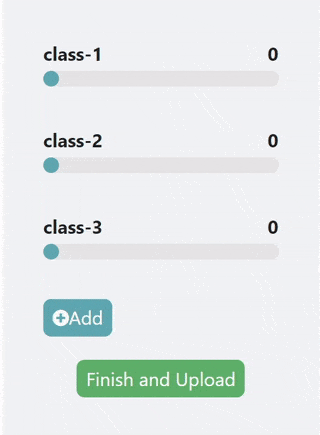
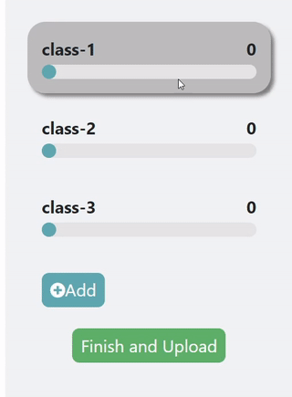

# LookHere Mannual

## Teaching Interface

### Step 1
<table>
  <tr>
    <td>Please first click on the labels (i.e., "class-1", "class-2") on the right side of the interface.This will allow you to rename the label. 
    After finishes typing the label name, <b>please press ENTER</b> to confirm that you finish editing.
    </td>
    <td style=" width: 20%"></td>
  </tr>
 </table>

### Step 2

<table>
  <tr>
    <td><ul>
      <li>Perform object demonstration in front of the web camera.</li>
      <li>Click on the camera icon () when the heatmap can correctly describe the object of interest.
      <li>When finish teaching one label, you need to click another label to activate the teaching process of another object (see gif on the right)</li>
    </ul></td>
    <td style=" width: 20%"></td>
  </tr>
</table>

## Model Assessment

The interface design is very similar to the teaching interface. 
Remember to click on the label you want to assess like what you did under Step 2.
Note that the current code cannot automatically bring the renamed labels into the model assessment interface. 